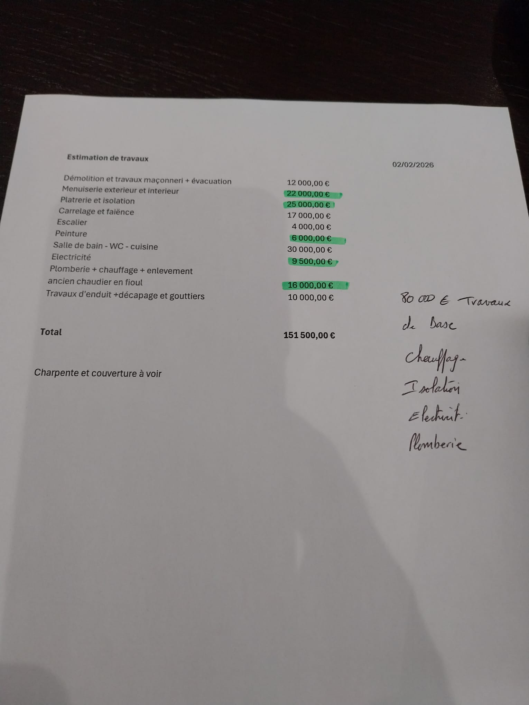

# Documents originaux

Cette page rassemble les documents sources du projet, tels que fournis en entrée de l'analyse.

---

## Téléchargements

| Document | Format | Description |
|---|---|---|
| [Avis de valeur](assets/avis-de-valeur.pdf) | PDF | Estimation de la valeur vénale et locative du bien, description des lots |
| [Plan financier 3 ans](assets/financial-plan.xlsx) | XLSX | Tableur de simulation financière : plan de financement et projet immobilier |
| [Business Plan (présentation)](assets/business-plan.pdf) | PDF | Support de présentation du business plan initial |
| [Chiffrage travaux](assets/chiffrage-travaux.jpeg) | JPEG | Devis initial des travaux de rénovation (premier scénario, 151 500 €) |

---

## Avis de valeur

**Source** : Cabinet d'expertise immobilière — Mars 2026

L'avis de valeur décrit le bien (maison mitoyenne R+1, 143 m², années 70-75) et estime :

- **Valeur vénale** du bien en l'état
- **Valeur locative** estimée pour 5 unités professionnelles
- Les caractéristiques du bien : 5 pièces, garage, terrain ~400 m²

!!! note "Contexte"
    Cet avis a été établi sur la base d'un scénario initial (2 bureaux de 30 m² au RDC + logement à l'étage). Le plan retenu est différent : 3 bureaux de 17 m² à l'étage + espace polyvalent de 60 m² au RDC.

---

## Plan financier 3 ans

**Source** : Tableur Excel élaboré par la porteuse de projet

Contient deux onglets principaux :

- **Plan de financement** : comparaison de scénarios d'acquisition (Maison Castel, appartement, restaurant), détail des coûts, mensualités, aides
- **Projet Immo** : simulation de rentabilité, revenus locatifs, charges, cash-flow

!!! note "Contexte"
    Le scénario retenu est « Maison Castel » (acquisition réalisée à ~253 210 €). Les autres scénarios (resto, appart) sont caducs. Le budget travaux a été réduit à **85 000 €** (vs 151 500 € dans le tableur initial).

---

## Business Plan (présentation)

**Source** : Support PowerPoint — Mars 2026

Structure de présentation du business plan initial, comprenant :

- Identité du projet et du porteur
- Description du bien et de l'emplacement
- Plan d'aménagement envisagé
- Projections financières de base

---

## Chiffrage travaux (premier scénario)

**Source** : Devis artisan — Mars 2026

!!! warning "Attention — scénario abandonné"
    Ce chiffrage correspond au **premier plan** (bureaux en bas + logement en haut) pour un total de **151 500 €**. Le plan retenu est différent (bureaux en haut + espace polyvalent en bas) avec un budget revu à **85 000 €**.

Postes du premier chiffrage :

| Poste | Montant |
|---|---|
| Plomberie sanitaire | 10 000 € |
| Électricité | 15 000 € |
| Plâtrerie / Cloisons | 18 000 € |
| Peinture | 12 000 € |
| Revêtement de sols | 15 000 € |
| Menuiseries intérieures | 8 000 € |
| Cuisine / Kitchenette | 5 000 € |
| Divers / Imprévus | 10 000 € |
| Charpente / Couverture | À voir |
| **Total estimé** | **151 500 €** |

---

[← Retour à l'accueil](index.md)
